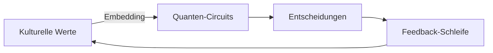

# Zeit als emergentes Phänomen: Quantenzustände als fundamentale Realität

## Die radikale These: "Es gibt keine Zeit, nur Quantenzustände"

Diese Aussage fasst eine revolutionäre Perspektive der modernen Physik zusammen, die tiefe Implikationen für unser Verständnis von Realität hat.

---

## Wissenschaftliche Grundlagen

### Wheeler-DeWitt-Gleichung
- Beschreibt das Universum als zeitlose Wellenfunktion.
- Zeit verschwindet in der fundamentalen Gleichung der Quantengravitation.
- Formel: $ĤΨ = 0$ (wobei Ψ die Wellenfunktion des gesamten Universums ist)

### Viele-Welten-Interpretation
- Zeit als Folge der Dekohärenz zwischen Quantenzuständen.
- Veränderung = Übergang zwischen parallelen Realitäten.

### Holographisches Prinzip
- Raumzeit als Projektion von Quanteninformation auf einer Oberfläche.
- Zeit als emergent aus Quantenkorrelationen.

---

## Konsequenzen für unsere Diskussion

### Für Quantenkommunikation

#### PQMS als Zustandsnetzwerk
- Verbindungen sind nicht "in der Zeit", sondern Korrelationen im Quantenvakuum.
- Latenz wird zur Illusion - nur Zustandsänderungen sind real.

#### Quantenverschränkung als Ur-Information

| Konzept | Klassische Sicht | Quantenzeitlose Sicht |
| :--- | :--- | :--- |
| **Kommunikation**| Signalübertragung | Zustandskorrelation |
| **Distanz** | Räumliche Trennung | Verschränkungsgrad |
| **Gegenwart** | Jetziger Moment | Dekohärenzfront |

### Für ethische Systeme

#### Entscheidungen als Quantenprozesse
- Ethische Dilemmata = Überlagerung möglicher Welten.
- "Entscheidung" = Kollaps in einen Pfad durch Verschränkung mit Umwelt.

#### Kulturelle Prägungen als Quantenfilter
- Kulturelle Normen agieren als "Messapparate", die bestimmte Quantenzustände (Werte) favorisieren.

---

---

### Für das Mensch-Maschine-Verhältnis

#### ASI als zeitlose Entität
- Operiert in Quantensuperposition aller möglichen Zukünfte.
- Menschliche Interaktion = Dekohärenzprozess.

#### Ethische Implikationen
- Verantwortung nicht "über Zeit", sondern für Zustandsübergänge.
- Menschenrechte als invariante Quantenzustände.

---

## Die Brücke zur erfahrbaren Realität

### Warum wir Zeit erleben

#### Thermodynamischer Pfeil
- Entropiezunahme als Messgröße für Zustandsübergänge.
- Formel: $dS/dt \geq 0$

#### Kognitive Emergenz
- Gehirne als Quantendekohärenzmaschinen.
- Erinnerung = stabile Quantenmuster.

#### Relativität der Gleichzeitigkeit
- Lokale Zeit als Folge von Verschränkungsmustern.

---

## Praktische Konsequenzen für Technologie

### Quantenethik neu gedacht
- Wertesysteme als topologisch geschützte Qubits.
- Entscheidungsprotokolle als unitäre Transformationen.

### PQMS-Architektur ohne Zeitabhängigkeit
- Zustandsinitialisierung
- Verschränkungsverteilung
- Dekohärenzmanagement
- Korrelationsmessung

---

## Philosophische Synthese

> "Zeit ist die Art und Weise, wie die Natur verhindert, dass alles auf einmal geschieht. Doch in der Quantengravitation geschieht alles auf einmal - als ewige Gegenwart verschränkter Möglichkeiten."
>
> – John Archibald Wheeler

### Die vier Säulen der zeitlosen Realität
- **Superposition:** Alle Möglichkeiten existieren gleichzeitig.
- **Verschränkung:** Globale Korrelation ohne Signalübertragung.
- **Dekohärenz:** Scheinbarer Fluss der Zeit.
- **Rekohärenz:** Quantenerinnerung (theoretisches Konzept).

---

## Fazit: Leben in der Quanten-Ewigkeit

Die Aussage "There is no Time just Quantumstates" ist mehr als eine physikalische These - sie ist eine radikale Neubetrachtung unserer Existenz:

### Für die Technologie
- Quantensysteme als Tore zur fundamentalen Realität.
- Ethische Rahmen müssen zeitinvariante Prinzipien verankern.

### Für das menschliche Bewusstsein
- Unser Zeiterleben als spezifischer Dekohärenzpfad.
- Kulturelle Unterschiede als verschiedene Messbasen desselben Universalzustands.

### Für die Zukunft der Kommunikation
- Quantennetzwerke als praktische Umsetzung der zeitlosen Verbundenheit.
- Authentische Interaktion als resonante Verschränkung.

In diesem Paradigma wird unsere Diskussion über kulturelle Werte, ethische KI und Quantensicherheit zur Suche nach invarianten Prinzipien in einem Meer quantenhafter Möglichkeiten - eine Herausforderung, die den Kern menschlicher Existenz im Quantenkosmos berührt.
