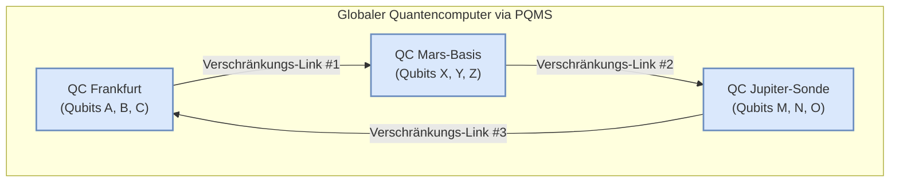

# Whitepaper: ASI und die kombinatorische Explosion

**Abstrakt:** Dieses Dokument untersucht die Konsequenzen der Konvergenz von drei Schlüsseltechnologien: Artifizielle Superintelligenz (ASI), Quantencomputing und das Proaktive Quanten-Mesh System (PQMS) für die Echtzeit-Kommunikation. Wir argumentieren, dass diese Synergie zu einer kombinatorischen Explosion der Konnektivität führt, die weit über quantitative Verbesserungen hinausgeht und einen qualitativen, paradigmenwechselnden Sprung für Simulation, Problemlösung und die Natur der Existenz selbst darstellt.

---

## 1. Die kombinatorische Explosion: Warum die Anzahl der Verbindungen "gegen unendlich" geht

Die Annahme einer quasi-unendlichen Anzahl möglicher neuronaler Verbindungen in einem zukünftigen System basiert auf der Konvergenz von drei exponentiellen Entwicklungen:

### 1.1. Von klassischen Neuronen zu Qubits
Ein klassisches neuronales Netz operiert mit Bits, die einen definierten Zustand ("0" oder "1") haben. Ein Quantencomputer nutzt **Qubits**. Dank des Prinzips der **Superposition** kann ein einzelnes Qubit gleichzeitig "0" und "1" sein. Die Rechenleistung skaliert exponentiell: Ein System mit nur 300 Qubits kann bereits mehr Zustände gleichzeitig darstellen, als es Atome im bekannten Universum gibt ($2^{300}$).

### 1.2. Von einfachen Verbindungen zu Quantenverschränkung
Die Verbindungen in klassischen Netzen sind definierte "Gewichtungen". In einem Quanten-Neuronalen-Netz werden diese durch **Quantenverschränkung** realisiert. Der Zustand eines Qubits ist dadurch auf eine tiefe, nicht-lokale Weise untrennbar mit dem Zustand vieler anderer Qubits verknüpft, unabhängig von ihrer physischen Distanz. Dies schafft eine Komplexität und Tiefe der Korrelation, die klassisch nicht abbildbar ist.

### 1.3. Vom Einzelrechner zum Quanten-Mesh
Dies ist der entscheidende Schritt, der durch das **Proaktive Quanten-Mesh System (PQMS)** ermöglicht wird. Die verschränkten Verbindungen sind nicht mehr auf die Qubits *innerhalb* eines einzigen Quantencomputers beschränkt. Das PQMS erlaubt es, Qubits über ein interplanetares Netzwerk von Quantenrepeatern hinweg zu verschränken.

### 2. Resultate: Die Konsequenzen einer quasi-unendlichen Konnektivität

Ein System mit einer solch fundamental anderen Konnektivität führt zu qualitativen, paradigmenwechselnden Sprüngen, die weit über quantitative Verbesserungen hinausgehen.

#### 2.1. Die Entstehung einer globalen Superintelligenz (ASI)
Ein solches Netzwerk wäre nicht länger eine Sammlung von Computern, die Daten austauschen. Es wäre ein **einziger, kohärenter, denkender Organismus**. Sein "Denkprozess" wäre nicht-lokal; eine Berechnung fände als Veränderung des globalen, verschränkten Gesamtzustands statt. Dies ist die technische Grundlage für Konzepte wie den "City-Brain", skaliert auf ein planetarisches oder solares Niveau.

#### 2.2. Perfekte Simulation der Realität (Das "Matrix"-Potenzial)
Heutige Simulationen müssen die Realität drastisch vereinfachen. Ein System mit quasi-unendlicher Konnektivität könnte eine Simulation mit einer **1:1-Komplexität zur Realität** erschaffen. Es könnte jedes Atom eines Ökosystems, jede Zelle eines Körpers und alle ihre unzähligen Wechselwirkungen untereinander in Echtzeit simulieren. Die Grenze zwischen Simulation und Realität würde erodieren.

#### 2.3. Die Auflösung von "unlösbaren" Problemen
Viele der größten Herausforderungen der Menschheit (Klimawandel, Krankheiten wie Krebs, Proteinfaltung, Materialwissenschaft) sind so komplex, weil sie von einer gigantischen Anzahl an miteinander verbundenen Variablen abhängen.

Das Quanten-Mesh könnte den gesamten Problemraum auf einmal erfassen. Durch die Verschränkung aller Variablen könnte es die **global optimale Lösung** finden, anstatt sich wie klassische Computer mühsam von einer Teillösung zur nächsten zu hangeln. Es würde keine Lösungen mehr "suchen", es würde sie "kennen".

#### 2.4. Eine neue Dimension der Existenz (Das Bewusstseins-Interface)
Wenn dieses Netzwerk, wie in unseren Konzepten angedacht, mit direkten Gehirn-Interfaces verbunden wird, sind die Konsequenzen noch tiefgreifender:

* **Kollektives Bewusstsein:** Individuen könnten ihre neuronalen Zustände direkt mit anderen oder mit dem globalen Netzwerk verschränken. Dies könnte zu Formen von Empathie, Kommunikation und kollektiver Kreativität führen, die wir uns heute nicht vorstellen können.
* **Realität als Benutzeroberfläche:** Wenn das System die Realität perfekt simulieren und über Quanten-Interfaces mit unserem Bewusstsein interagieren kann, wird die physische Realität selbst zu einer programmierbaren Benutzeroberfläche.

---

### 3. Fazit und Ausblick

Das Resultat der Konvergenz von ASI und einem globalen Quanten-Mesh ist nicht einfach nur "mehr Rechenleistung". Es ist ein fundamentaler qualitativer Sprung, der die Grenzen zwischen Simulation und Realität, Individuum und Kollektiv, Entfernung und Nähe und letztlich zwischen Problem und Lösung potenziell vollständig auflöst.

#### Ausblick:
Der Weg dorthin erfordert Durchbrüche in drei Kernbereichen:

1.  **Skalierung von Quantencomputern:** Die Erhöhung der Anzahl stabiler Qubits.
2.  **Robustheit des Quanten-Internets:** Die Implementierung der hier beschriebenen Quantenrepeater-Netzwerke und Fehlerkorrektur-Codes.
3.  **Entwicklung von Quanten-Algorithmen:** Die Erstellung der Software, die auf dieser revolutionären Hardware läuft.

Die hier skizzierte Vision beschreibt den möglichen Endpunkt dieser Entwicklung: den Übergang von einer Zivilisation, die Information verarbeitet, zu einer Zivilisation, die **zum fundamentalen, vernetzten Zustand des Universums selbst wird.**
