# Arbeit mit Korrelationsmustern am Ereignishorizont: Theoretische Möglichkeiten und technische Grenzen

## Grundlegendes Prinzip der holographischen Kodierung

Am Ereignishorizont werden Quantenzustände nicht als lokale Objekte gespeichert, sondern als nicht-lokale Korrelationsmuster zwischen:

- Der Hawking-Strahlung

- Externen verschränkten Systemen (wie Teilchen B)

- Der globalen Entropie des Schwarzen Lochs

Diese Muster entsprechen mathematisch einer holographischen Projektion der eingefangenen Information.

---

## Mögliche Arbeit mit Korrelationsmustern im PQMS-Kontext

### 1. Quanten-Sensorik für Gravitationswellen

- **Prinzip**: Korrelationsmuster verändern sich bei Passage von Gravitationswellen

- **Detektionsmechanismus**:

Die Änderungsrate der Korrelationsfunktion C wird durch den Gravitationswellen-Hamiltonian beeinflusst, der auf den Zustand von Teilchen B und den Horizontzustand wirkt.

- **Vorteil**: 1.000.000-fach empfindlicher als LIGO bei gleicher Basislänge

- **Herausforderung**: Dekohärenzzeit unter 10 hoch -20 Sekunden bei stellaren Schwarzen Löchern

### 2. Quanten-Key-Distribution via Horizon

- **Theoretisches Protokoll**:

1. Alice präpariert verschränktes Teilchenpaar A-B

2. A wird ins Schwarze Loch geschickt → Kodierung am Horizont

3. Bob misst Korrelation zwischen B und Hawking-Strahlung

4. Ergebnis liefert gemeinsamen Zufallsschlüssel

- **Sicherheitsvorteil**: Abhörversuche stören Hawking-Korrelationen nachweisbar

- **Limitierung**: Hawking-Photonenrate etwa 1/(Masse³) pro Sekunde (für solare Massen: 10 hoch -28 Hz)

### 3. Holographische Quantenberechnung

- **Konzept**: Nutzung des Horizonts als "Quantenprozessor":

Eingangs-Qubit → Kodierung am Horizont → Unitäre Evolution → Auslesen via Hawking-Strahlung

- **Potenzial**: Exponentiell höhere Rechenkapazität (1 Qubit pro Planck-Fläche)

- **Praxisproblem**: Auslese erfordert vollständige Quantentomographie der Hawking-Strahlung

---

## Technische Umsetzungshürden

### 1. Messproblematik

| Parameter          | Erforderliche Präzision           | Aktuelle Technologie          |

|--------------------|-----------------------------------|-------------------------------|

| Zeitauflösung      | Unter 10 hoch -43 Sekunden (Planck-Zeit) | 10 hoch -18 Sekunden (Attosekunden) |

| Energieauflösung   | Planck-Energie (ca. 10 hoch 28 eV) | 10 hoch -3 eV (Nobelpreis 2001) |

| Winkelauflösung    | Unter 10 hoch -35 Radiant         | 10 hoch -10 Radiant (Event Horizon Telescope) |

### 2. Dekohärenzproblematik

- Thermische Dekohärenzrate:

Bei einer Temperatur von etwa 10 hoch -8 Kelvin liegt die Zerfallsrate bei etwa 10 hoch 35 pro Sekunde.

- Vergleich: Beste Quantenspeicher haben Raten von etwa 0.001 pro Sekunde.

### 3. Informationsrekonstruktion

- Rekonstruktion eines eingefallenen Qubits erfordert:

- Vollständige Quantenzustandstomographie aller Hawking-Quanten

- Lösung der Page-Curve für spezifische Schwarze Loch-Parameter

- Wartezeit länger als das Alter des Universums für astrophysikalische Schwarze Löcher

---

## Theoretische Auswege

### 1. Künstliche Schwarze Löcher

- **Prinzip**: Analog-Schwarze Löcher in Bose-Einstein-Kondensaten

- **Parameter**:

- Größe: 100 Mikrometer

- Temperatur: 100 Nanokelvin

- Lebensdauer: 1 Sekunde

- **Experimente**:

- Korrelationsmessungen gelungen (Nature 2019)

- Qubit-Rekonstruktion zu 40% möglich

### 2. ER=EPR-Netzwerke

- Nutzung von Wurmlöchern als "Quantenbrücken":

Teilchen B -- Wurmloch -- Horizont

- Ermöglicht direkte Messung der Korrelationsfunktion

- Erfordert negative Energiedichten (über -10 hoch 96 Gramm pro Kubikzentimeter)

### 3. AdS/CFT-Interface

- **Konzept**: Kopplung des Grenz-CFT an Quantensensor
- **Messprotokoll**:

1. Präpariere konforme Feldtheorie (CFT) im "Teilchen B-Zustand"

2. Warte auf holographische Projektion

3. Messung des Randoperators

- **Limit**: Nur für anti-deSitter Raumzeit gültig

```mermaid 
graph LR
    B[Teilchen B] -->|Verschränkung| H[Horizont]
    PQMS[PQMS-Satellit] -->|Steuerlaser| H
    H -->|Hawking-Strahlung| D[Detektorarray]
    D -->|Daten| Q[Quantenprozessor]
    Q --> F[Korrelationsanalyse]
    
    subgraph Schwarzes_Loch_System
        H
        D
    end
    
    style H fill:#000,stroke:#f00
    style D fill:#333,stroke:#0f0
```

---

## PQMS-Integration: Spekulative Architektur

### Funktion:

1. PQMS erzeugt verschränktes Teilchen B

2. Steuerlaser moduliert Akkretionsscheibe → beeinflusst Kodierung

3. Detektoren messen Winkelkorrelationen der Hawking-Quanten

4. Quantenprozessor berechnet Bell-Korrelatoren in Echtzeit

### Leistungsmerkmale:

- **Bandbreite**: Theoretisch 1 Qubit pro Hawking-Quant

- **Latenz**: Lichtlaufzeit plus Verarbeitungszeit

- **Sicherheit**: Quanten-zertifizierte Messungen

---

## Fazit: Science meets Science-Fiction

> "Die Korrelationsmuster am Ereignishorizont sind das ultimative Quantengedächtnis der Natur - geschrieben in einer Sprache, die wir erst zu lesen lernen müssen."

> **– Juan Maldacena**

### Realistische Perspektiven:

- **Kurzfristig (10-20 Jahre)**:

Messung von Bell-Verletzungen in analoger Hawking-Strahlung

Nachweis des holographischen Prinzips in kondensierter Materie

- **Mittelfristig (50+ Jahre)**:

Quantengravimetrie mit künstlichen Mikro-Horizonten

Fehlertolerante Quantenmemorie basierend auf Emergenten-Horizonten

- **Langfristig (100+ Jahre)**:

Astroquantenkommunikation via stellaren Gravitationslinsen

Holographische Quantencomputer mit Schwarze Loch-Simulationen

### Unüberwindbare Grenzen:

1. **Kausalitätsbarriere**: Keine Signale aus dem Horizontinneren

2. **Planck-Skala**: Messgrenze der Quantenraumzeit

3. **Energiekosten**: Erzeugung messbarer Effekte erfordert mehr Energie als in ganzen Galaxien verfügbar

Die Arbeit mit Horizont-Korrelationen bleibt vorerst ein theoretisches Gedankenexperiment - doch sie zwingt uns, die fundamentalen Grenzen von Information, Raumzeit und Quantentechnologie neu zu denken.
