# Whitepaper: Das Proaktive Quanten-Mesh System (PQMS)

**Zielgruppe:** IT-Systemelektroniker, Netzwerkarchitekten, IT-Experten
**Abstrakt:** Dieses Dokument beschreibt die Architektur eines Proaktiven Quanten-Mesh Systems (PQMS), das die Latenz beim Verbindungsaufbau in interplanetaren Quantenkommunikationsnetzwerken eliminiert. Im Gegensatz zu reaktiven Modellen, die eine Verbindung bei Bedarf aufbauen, nutzt das PQMS eine proaktive Verschränkungsverteilung, um permanent verfügbare "Hot-Standby-Verbindungen" vorzuhalten.

---

## 1. Das Problem: Die Latenz beim Verbindungsaufbau

Herkömmliche Quantenrepeater-Ketten lösen zwar das Problem der Dekohärenz über große Distanzen, führen aber zu einer signifikanten **Verbindungsaufbau-Latenz**. Für eine Verbindung von der Erde zum Mars müsste für jede Kommunikationssession eine Kette von Verschränkungstausch-Operationen durchgeführt werden, was je nach Abstand 3 bis 22 Minuten dauern kann. Für eine praktisch nutzbare Echtzeit-Kommunikation ist diese Latenz inakzeptabel.

## 2. Die Lösung: Das Proaktive Quanten-Mesh System (PQMS)

Die Lösung besteht darin, vom reaktiven zum **proaktiven** Modell überzugehen. Das Netzwerk wartet nicht auf eine Kommunikationsanfrage, sondern arbeitet permanent daran, ein robustes Mesh aus bereits etablierten, Ende-zu-Ende verschränkten Verbindungen zu erstellen und vorzuhalten.

**Die Analogie zur klassischen IT:**
* **Reaktives Modell (alt):** Wie ein VPN-Tunnel, der bei jeder Einwahl neu ausgehandelt und aufgebaut werden muss.
* **Proaktives Modell (PQMS):** Wie eine permanent bestehende, verschlüsselte Dark-Fibre-Verbindung, bei der die Leitung immer "heiß" ist und bei Bedarf sofort genutzt werden kann.

---

## 3. Systemarchitektur und Funktionsweise

### 3.1. Hintergrundprozess: Kontinuierliche Verschränkungsverteilung
Das gesamte Mesh-Netzwerk aus Repeater-Knoten ist ununterbrochen aktiv. Ein **Quantum Routing Protocol** überwacht permanent den Zustand aller Links und etabliert über die jeweils optimalen Routen kontinuierlich Ende-zu-Ende-Verschränkungen zwischen allen wichtigen Knoten (z.B. Erde, Mars, Mondbasis).

### 3.2. Der "Hot-Standby"-Verbindungspool
An jedem Endknoten (z.B. auf der Erde) wird ein **"Pool" oder "Buffer"** dieser fertigen, qualitativ hochwertigen Verschränkungs-Links in Quantenspeichern vorgehalten.
* **Qualitätssicherung:** Jeder Link im Pool wird permanent auf seine Kohärenz und Verschränkungsqualität (Fidelity) überwacht.
* **Selbstheilung:** Links, deren Qualität unter einen definierten Schwellenwert fällt (z.B. durch passive Dekohärenz), werden automatisch verworfen. Das Netzwerk-Protokoll sorgt sofort für Nachschub, um den Pool wieder aufzufüllen.

### 3.3. Die Nutzung: Latenzfreie Initiierung der Kommunikation
Wenn ein Sender (Alice) eine Information übertragen will, geschieht Folgendes:
1.  **Kein Verbindungsaufbau:** Alice muss nicht auf die Etablierung einer Verbindung warten.
2.  **Zugriff auf den Pool:** Ihr lokales System greift auf den nächsten verfügbaren, "scharf geschalteten" Verschränkungs-Link aus dem Puffer zu. Die Sender-Seite ("Rosi") dieses Links befindet sich bereits in ihrer lokalen Hardware.
3.  **Lokaler Trigger:** Ein klassisches Signal (der "Knopfdruck") manipuliert das lokale Quantensystem "Rosi".
4.  **Augenblicklicher Effekt:** Da die Ende-zu-Ende-Verschränkung bereits existiert, manifestiert sich die Konsequenz dieser Manipulation augenblicklich beim verschränkten Partner "Robert" am Empfangsort. Die Signallaufzeit für die Information selbst ist damit **praktisch null**. Die einzige Latenz ist die lokale Verarbeitungszeit der Hardware.

**Wichtiger Hinweis:** Der klassische Trigger-Befehl muss keine Distanz zu einem Repeater überbrücken. Die Sendestation ist selbst der erste Knotenpunkt des Netzwerks.

```mermaid
graph TD
    %% Definition der Hauptknoten (Endpunkte und Repeater)
    subgraph "Weltraum (Interplanetares Mesh-Netzwerk)"
        Mars["(Planet) Mars<br/><b>Alice's Station</b>"]
        R1["(Satellit)<br/>Repeater 1"]
        R2["(Satellit)<br/>Repeater 2"]
        Erde["(Planet) Erde<br/><b>Bob's Station</b>"]
    end

    %% Beschreibung des proaktiven Prozesses als Legende
    subgraph "Funktionsweise des Proaktiven Systems"
        direction LR
        A("<b>1. Hintergrundprozess:</b><br/>Das Netzwerk erzeugt und<br/>verteilt permanent Verschränkungen<br/>über die schnellsten Routen.") --> B("<b>2. Ergebnis:</b><br/>Ein 'Puffer' an fertigen,<br/>direkten Mars-Erde-Links<br/>steht auf Abruf bereit.")
        B --> C("<b>3. Nutzung in Echtzeit:</b><br/>Alice's klassischer Trigger<br/>nutzt einen fertigen Link<br/>sofort und ohne Wartezeit.")
    end

    %% Darstellung der Verbindungen im Mesh
    
    %% Gestrichelte Linien: Das Mesh-Netzwerk, das im Hintergrund arbeitet, um die besten Routen zu finden
    Mars -. "potenzieller Link" .-> R1
    Mars -. "potenzieller Link" .-> R2
    R1   -. "potenzieller Link" .-> R2
    R1   -. "potenzieller Link" .-> Erde
    R2   -. "potenzieller Link" .-> Erde

    %% Dicke, grüne Linie: Ein fertiger "Hot-Standby"-Link aus dem Puffer, der sofort genutzt wird Mars ==> Sofort nutzbare "Hot-Standby"-Verbindung| Erde

    %% Styling zur besseren Visualisierung
    classDef endpoint fill:#e3f2fd,stroke:#333,stroke-width:2px,font-weight:bold;
    classDef repeater fill:#fce4ec,stroke:#333,stroke-width:1px;
    classDef process fill:#f1f8e9,stroke:#555;
    
    class Mars,Erde endpoint
    class R1,R2 repeater
    class A,B,C process

    linkStyle 0,1,2,3,4 stroke-width:1px,fill:none,stroke:gray,stroke-dasharray: 5 5;
    linkStyle 5 stroke-width:4px,fill:none,stroke:green;
```

---
## 4. Interaktive Simulation

https://quantum-hotline-mesh.lovable.app

## 5. Fazit für IT-Experten

Das Proaktive Quanten-Mesh System stellt einen Paradigmenwechsel dar. Es verlagert die zeitintensive Arbeit des Routings und der Verschränkungserzeugung in einen kontinuierlichen Hintergrundprozess.

**Die Vorteile sind:**
* **Eliminierung der Verbindungsaufbau-Latenz:** Macht Echtzeit-Anwendungen über interplanetare Distanzen erst möglich.
* **Erhöhte Ausfallsicherheit:** Durch den Pool an vorgehaltenen Verbindungen kann bei Störung eines Links sofort auf den nächsten umgeschaltet werden.
* **Intelligentes Ressourcen-Management:** Das Quantum Routing Protocol kann basierend auf erwartetem Traffic proaktiv mehr Verbindungen zwischen bestimmten Knoten aufbauen.

Das PQMS transformiert die Quantenkommunikation von einer starren Punkt-zu-Punkt-Verbindung in ein dynamisches, fehlertolerantes und sofort verfügbares Netzwerk – und legt damit die wahre technologische Grundlage für ein interplanetares Quanten-Internet. Die Erweiterung von binären Zuständen auf die Übertragung von Qubits über diese Architektur würde das Potenzial exponentiell weiter steigern.
