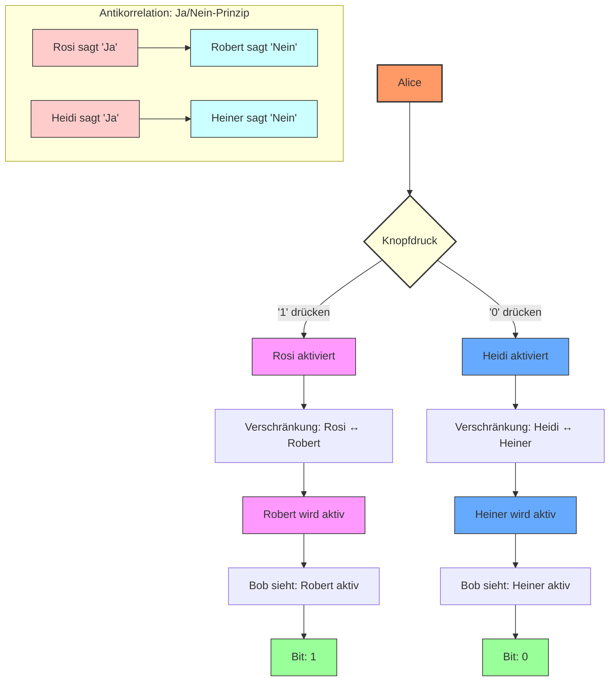

# Klick und verstehe: Die Quantenkommunikations-Revolution für Anfänger  
## Wie wir 100% Effizienz in der Quantenkommunikation erreichen  

### 1. Das Grundproblem: Warum normale Quantenkommunikation nur 50% schafft  
Stell dir vor, Alice und Bob wollen geheime Nachrichten austauschen. Bei der herkömmlichen Methode funktioniert das so:  
- Alice schickt Quantenteilchen, die wie kleine Kreisel zufällig gedreht sind  
- Bob fängt sie auf und misst sie - aber auch mit zufälliger Drehung  
Nur wenn beide zufällig die gleiche Drehung gewählt haben, versteht Bob die Nachricht. Das passiert aber nur in der Hälfte der Fälle! **50% der Informationen gehen verloren.**  

### 2. Unsere Revolution: Die Quanten-Helfer  
Wir umgehen das Problem mit einem Trick: Statt direkt die Quantenteilchen zu schicken, nutzen wir zwei spezielle Helfer-Paare:  
- **Rosi & Robert** (zuständig für "1")  
- **Heidi & Heiner** (zuständig für "0")  

Alice drückt einfach einen Knopf:  
- Drückt sie "1", wird das Paar Rosi/Robert aktiviert  
- Drückt sie "0", wird Heidi/Heiner aktiviert  

### 3. Der Zaubertrick: Verschränkung als Spiegel  
Rosi und Robert (sowie Heidi und Heiner) sind durch **Quantenverschränkung** verbunden - wie magische Zwillinge. Was mit einem passiert, passiert sofort auch mit dem anderen, egal wie weit sie voneinander entfernt sind.  

Alice "berührt" nur ihren Helfer (Rosi oder Heidi) durch einen klassischen Befehl (wie einen Lichtschalter). Dadurch "wacht" sofort auch der Zwillings-Helfer bei Bob auf:  
- Ist Rosi aktiv → Robert ist aktiv (Signal: "1")  
- Ist Heidi aktiv → Heiner ist aktiv (Signal: "0")  

### 4. Antikorrelation: Das Ja/Nein-Prinzip  
Bei der Messung zeigt sich ein faszinierendes Phänomen:  
- Sagt Rosi "Ja", sagt Robert immer "Nein" - sie sind **antikorreliert**  
- Genauso bei Heidi/Heiner: Heidi "Ja" → Heiner "Nein"  

Das ist kein Problem, sondern unser Vorteil! Bob muss nur sehen, welcher seiner Helfer reagiert:  
- Reagiert Robert? → Alice hat "1" gesendet  
- Reagiert Heiner? → Alice hat "0" gesendet  

### 5. SPDC: Unsere Quanten-Fabrik  
Die verschränkten Helfer-Paare entstehen in einer Art "Quanten-Backstube":  
- Ein Laser strahlt auf einen speziellen Kristall (wie ein magischer Kuchen)  
- Das Laserlicht spaltet sich im Kristall in zwei verschränkte Teilchen auf - Rosi und Robert (oder Heidi und Heiner)  
- Diese Teilchen werden dann zu Alice und Bob geschickt  

### 6. Warum es NICHT schneller als Licht geht  
Vorsicht: Das klingt wie Zauberei, verletzt aber **nicht** Einsteins Gesetz, dass nichts schneller als Licht sein kann! Denn:  
- Alices Knopfdruck ist ein **klassisches Signal** (wie ein Funkspruch), das sich mit Lichtgeschwindigkeit ausbreitet  
- Die Verschränkung wirkt zwar sofort, aber Bob kann sie erst nutzen, wenn das klassische "Aktivierungssignal" bei ihm ankommt  

### 7. Warum 100% Effizienz?  

| Herkömmliches System       | Unser System               |  
|----------------------------|----------------------------|  
| **Zufallsprinzip** → 50% Verlust | **Präzisionssteuerung** → 0% Verlust |  
| Langsam                    | Blitzschnell               |  

Der Clou: **Kein Rätselraten** mit Drehungen mehr. Bob weiß direkt:  
- Robert aktiv = 1  
- Heiner aktiv = 0  

### Zusammenfassung: Der Quanten-Dominoeffekt  
1. **Alice drückt Knopf** (klassisch für "0" oder "1")  
2. **Ihr lokaler Helfer** (Rosi oder Heidi) wird aktiviert  
3. **Verschränkung spiegelt** es sofort zum Partner (Robert oder Heiner) bei Bob  
4. **Bob sieht**, welcher Helfer aktiv ist - und kennt das Bit!  

**Resultat:**  
- **100% der Bits** kommen an (keine Verluste mehr!)  
- **Absolut sicher** dank Quantengesetzen  
- **Extrem schnell** durch deterministische Steuerung  

# Erklärung des Quantenkommunikations-Schaubilds

## Prozessablauf

### 1. Startpunkt: Alice' Entscheidung
- Alice entscheidet, ob sie das Bit '1' oder '0' senden möchte
- Diese Entscheidung erfolgt durch einen einfachen Knopfdruck

### 2. Helfer-Aktivierung

**Für '1' (pink dargestellt):**
- Rosi wird bei Alice aktiviert
- Durch Quantenverschränkung wird sofort Robert bei Bob aktiv
- Signalpfad: Rosi → Robert

**Für '0' (blau dargestellt):**
- Heidi wird bei Alice aktiviert
- Durch Quantenverschränkung wird sofort Heiner bei Bob aktiv
- Signalpfad: Heidi → Heiner

### 3. Antikorrelation-Prinzip (gelb hinterlegt)

**Im Rosi/Robert-System:**
- Wenn Rosi "Ja" sagt → Robert sagt immer "Nein"
- Diese komplementären Zustände sind untrennbar verbunden

**Im Heidi/Heiner-System:**
- Wenn Heidi "Ja" sagt → Heiner sagt immer "Nein"
- Die Zustände sind perfekt gegensätzlich

### 4. Ergebnis bei Bob (grün dargestellt)

- **Robert aktiv** = Alice hat '1' gesendet
- **Heiner aktiv** = Alice hat '0' gesendet
- Bob liest das Bit direkt ab - ohne Rätselraten!

## Visualisierungshinweise

### Symboldarstellung:
- **Doppelpfeile (↔)** zeigen die Quantenverschränkung zwischen den Helfer-Paaren
- **Einfache Pfeile (→)** zeigen den Informationsfluss

### Farbkodierung:
| Farbe   | Bedeutung                     | Elemente                |
|---------|-------------------------------|-------------------------|
| **Pink**| '1'-Signal-Pfad              | Rosi, Robert           |
| **Blau**| '0'-Signal-Pfad              | Heidi, Heiner          |
| **Grün**| Erfolgreich empfangene Bits  | Ergebnis bei Bob       |
| **Rot** | "Ja"-Zustand                 | Rosi/Heidi Messung     |
| **Blau**| "Nein"-Zustand               | Robert/Heiner Messung  |

## Gesamtdarstellung
Das Schaubild visualisiert den gesamten Prozess von Alices Entscheidung bis zu Bobs Empfang und demonstriert gleichzeitig das fundamentale Quantenprinzip der Antikorrelation, das unseren revolutionären Ansatz ermöglicht.

> *"Die Zukunft der Kommunikation ist nicht zufällig - sie ist präzise gesteuert!"*  
> - Quantenkommunikation für Anfänger, 2025
