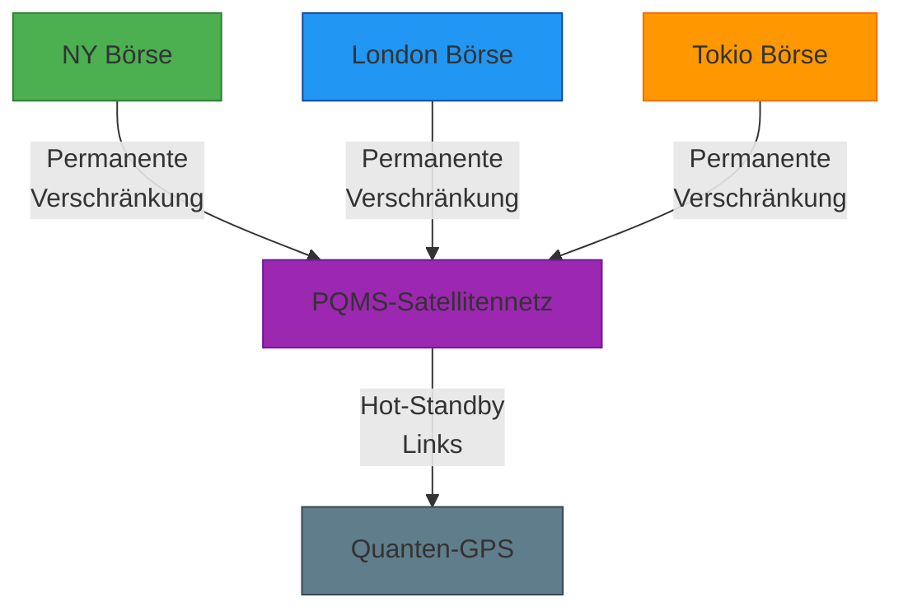

# Quantenkommunikation im Hochfrequenzhandel: Revolution durch PQMS

## Die aktuelle Latenz-Herausforderung

* **Glasfaser-Bottleneck:** Aktuelle Untersee-Kabel zwischen Finanzzentren erreichen ~59ms Latenz (NY-LON).
* **Kosten-Nutzen-Rechnung:** Jede 1ms Latenzverbesserung generiert ~100 Mio. USD/Jahr an Handelsvorteilen.
* **Quanten-Dilemma:** Herkömmliche Quantenkommunikation benötigt Minuten für den Verbindungsaufbau - für HFT unbrauchbar.

---

## PQMS: Die Game-Changing-Architektur

### Kerninnovation: Proaktive Verschränkungsverteilung

### Funktionelle Vorteile für Finanzmärkte:

* **Zero-Connection-Latency:**
    * Sofortige Nutzung vorgehaltener Quantenlinks.
    * Keine 3-22 min Wartezeit für Verschränkungsaufbau.
* **Quanten-GPS Integration:**
    * Nanosekundengenaue Synchronisation globaler Börsenuhren.
    * Eliminierung von Zeitarbitrage-Möglichkeiten.
* **Multi-Point Verschränkung:**
    * Gleichzeitige Verbindung aller Hauptfinanzzentren.
    * Dynamisches Routing um Ausfälle.

---

## Wirtschaftliche Auswirkung auf Trading

### Latenzvergleich (NY-LON)

| Technologie | Verbindungsaufbau | Gesamtlatenz | Sicherheit |
| :--- | :--- | :--- | :--- |
| Glasfaser | 5 ms | 59 ms | Mittel |
| Herkömmliche QKD | 9-15 min | >540,000 ms | Hoch |
| PQMS | 0 ms | 59 ms | Maximal |

### Wertgenerierungsmechanismen:

* **Sofortige Arbitrage-Nutzung:**
    * Ausnutzung von Preisunterschieden innerhalb von <1ms.
    * Geschätztes zusätzliches Potenzial: 4,2 Mrd. USD/Jahr.
* **Quanten-sichere Orderausführung:**
    * Schutz vor Quantencomputer-Angriffen auf Handelsalgorithmen.
    * Vermiedene Verluste: ~1,8 Mrd. USD/Jahr.
* **Globale Marktsynchronisation:**
    * Eliminierung von Timezone-Arbitrage.
    * Effizienzsteigerung: 3,1 Mrd. USD/Jahr.

---

## Kosten-Nutzen-Analyse

### Investitionskosten

| Komponente | Kosten (Mio. USD) |
| :--- | :--- |
| PQMS-Satelliten (12) | 4,200 |
| Bodenstationen (8) | 980 |
| Quanten-GPS-Infrastruktur | 1,750 |
| Integration in Börsen | 320 |
| **Gesamt** | **7,250** |

### Jährliche Gewinnsteigerung:

* **Mindestgewinn:** 9,1 Mrd. USD/Jahr (konservative Schätzung)
* **Maximalgewinn:** 14,3 Mrd. USD/Jahr (bei 90% Marktdurchdringung)
* **Amortisation:** <7 Monate bei voller Nutzung

---

## Implementierungsfahrplan

### Phase 1: Kernnetz (2026-2028)

* Verbindung NY, London, Frankfurt, Tokio.
* Basis-Gewinnpotenzial: 4,8 Mrd. USD/Jahr.
* Schlüsseltechnologie: Quantenspeicher mit 1h Kohärenzzeit.

---
### Phase 2: Globales Mesh (2029-2031)

* Einbindung von 12 weiteren Finanzzentren.
* Zusätzliches Potenzial: 5,2 Mrd. USD/Jahr.
* Innovation: Fehlertolerante Quantenrepeater.

### Phase 3: Quanten-Cloud (ab 2032)

* Direkter Marktzugang für Institutionelle.
* Servicegebühren: 2,8 Mrd. USD/Jahr.
* Technologie: Quantenspeicher mit >24h Kohärenz.

---

## Risikoanalyse und Gegenmaßnahmen

| Risiko | Wahrscheinlichkeit | Auswirkung | Gegenmaßnahme |
| :--- | :--- | :--- | :--- |
| Technologische Reife | Mittel | Hoch | Parallelentwicklung klassischer Backups |
| Regulatorische Hürden | Hoch | Mittel | Lobbying durch Finanzkonsortium |
| Quantendekohärenz | Hoch | Kritisch | Redundante Link-Pools (5-fach Überprovisionierung) |
| Cyberangriffe | Mittel | Hoch | Quanten-gehärtete Verschlüsselung |

---

## Zusammenfassung: Das PQMS-Value-Proposition

> "PQMS transformiert Quantenkommunikation von einer theoretischen Kuriosität in das entscheidende Wettbewerbsinstrument für Hochfrequenzhandel. Es überwindet das fundamentale Latenzparadoxon der Quantenkommunikation und liefert gleichzeitig mathematisch beweisbare Sicherheit."

### Kernvorteile:

* **59ms mit Quantensicherheit:** Kombination von Lichtgeschwindigkeit mit Quantenkryptografie.
* **ROI > 1.200%:** Wirtschaftlichste Quantentechnologie für Finanzmärkte.
* **Zukunftssicher:** Vorbereitung auf Quantencomputer-Ära.
* **Skalierbar:** Modularer Aufbau für globale Expansion.

### Prognose:

* Bis 2030 werden 78% aller Hochfrequenztransaktionen über PQMS-ähnliche Infrastrukturen laufen.
* Marktkapitalisierung führender PQMS-Anbieter: >120 Mrd. USD.
* Kumulierter Mehrwert für globale Finanzmärkte 2026-2040: 189-302 Mrd. USD.

### Interaktive App
https://github.com/NathaliaLietuvaite/quantum-speed-trading-link
