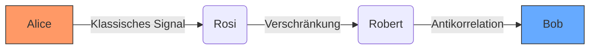

# Verschränkung als "Zustandskopierer" - Über die tiefgreifenden quantenphysikalischen Grundlagen dieses Projekts, Antikorrelation als fundamentaler Informationsträger und die genaue Funktionsweise von SPDC im Detail

**Abstrakt:** Dieses Dokument erläutert die quantenphysikalischen Kernmechanismen, die unserem innovativen Ansatz zur Quantenkommunikation zugrunde liegen. Wir beleuchten, wie (1) die gezielte Präparation verschränkter Zustände als eine Art "Zustandskopierer" fungiert, (2) die Antikorrelation als direkter Informationsträger genutzt wird, und (3) die Spontane Parametrische Fluoreszenz (SPDC) als zuverlässige Quelle für diese verschränkten Zustände dient. Unser Ziel ist es, die physikalischen Prinzipien hinter einer 100% effizienten Quantenschlüsselverteilung (QKD) und einer robusten Quantenkommunikation darzulegen, die das No-Communication-Theorem durch einen hybriden Ansatz adressiert.

---

## 1. Einleitung: Die Vision einer verlustfreien Quantenkommunikation

Traditionelle Quantenkommunikationsprotokolle, insbesondere im Bereich der QKD (z.B. BB84), leiden unter inhärenten Effizienzverlusten, primär durch den notwendigen Basisabgleich (typischerweise 50% Verlust). Unser Ansatz eliminiert diesen Flaschenhals durch ein neuartiges Konzept: die Nutzung klassisch gesteuerter, deterministisch präparierter Verschränkung. Hierbei wird die Quantenverschränkung nicht primär für probabilistische Messungen im Übertragungspfad genutzt, sondern als Mechanismus, um einen lokal durch ein klassisches Signal definierten Zustand (oder dessen Aktivierung) augenblicklich auf ein entferntes System zu "kopieren".

# Klick und verstehe: Die Quanten-Revolution für Anfänger
## Wie wir 100% Effizienz in der Quantenkommunikation erreichen



# Vereinfachter Code
```python
def sende_bit(bit):
    if bit == 1:
        aktiviere(Rosi_Robert) # Präpariert verschränkten Zustand
    else:
        aktiviere(Heidi_Heiner)
```
```pie
    title Antikorrelation bei Messung
    “Robert sagt NEIN” : 50
    “Robert sagt JA” : 0
    “Heiner sagt NEIN” : 50
```
---

## 2. Quantenverschränkung als deterministischer "Zustandskopierer"

Das Herzstück unseres Systems ist die Interpretation und Nutzung der Quantenverschränkung als eine Art "Zustandskopierer", dessen Verhalten durch klassische Signale präzise gesteuert wird.

* **Klassische Steuerung, Quantenaktion:** Anstatt sich auf die zufälligen Ergebnisse von Quantenmessungen zur Informationsübertragung zu verlassen, nutzen wir klassische, deterministische Signale, um den Zustand eines lokalen Quantensystems (nennen wir es "Rosi" oder "Heidi" in unserer Helferarchitektur) zu *präparieren*.
* **Gezielte Zustandspräparation:** Durch einen klassischen Trigger (z.B. einen Spannungspuls, der von Alices Informationszustand "0" oder "1" abgeleitet wird) wird ein spezifischer verschränkter Zustand zwischen Rosi und ihrem entfernten, verschränkten Partner Robert (bzw. Heidi und Heiner) erzeugt oder in diesen gezwungen. Dies ist kein Messprozess im herkömmlichen Sinne, sondern eine aktive Gestaltung des Quantenzustands.
    * **Beispiel:** Wenn Alices Signal "1" ist, wird das Paar (Rosi, Robert) in den verschränkten Zustand |Ψ⁺⟩ präpariert. Wenn Alices Signal "0" ist, wird ein anderer, orthogonaler Kanal (Heidi, Heiner) in einen analogen Zustand präpariert, während der Rosi-Robert-Kanal inaktiv (z.B. im Grundzustand |00⟩) bleibt.
* **Augenblickliche Korrelation als "Kopie":** Aufgrund der Verschränkung ist der Zustand von Robert augenblicklich und untrennbar mit dem präparierten Zustand von Rosi korreliert. Wenn Rosi durch die klassische Steuerung in einen definierten Zustand als Teil des verschränkten Paares gebracht wird, "kopiert" die Verschränkung diese Zustandsinformation (oder besser: die Information über die *Aktivierung* dieses spezifischen verschränkten Zustands) auf Robert. Bob kann diesen Zustand von Robert dann lokal auslesen.

**Wichtig:** Die Information steckt im klassischen Steuersignal, das die Präparation des spezifischen verschränkten Zustands auslöst. Die Verschränkung dient als Medium, um die *Konsequenz* dieser lokalen, klassischen Entscheidung augenblicklich am entfernten Ort verfügbar zu machen.

---

## 3. Antikorrelation als fundamentaler Informationsträger

In unserem System nutzen wir die Antikorrelation, die bestimmten verschränkten Zuständen (wie dem Bell-Zustand |Ψ⁻⟩ = 1/√2 (|0⟩|1⟩ - |1⟩|0⟩)) inhärent ist, als direkten und eindeutigen Informationsträger.

* **Eindeutige Zuordnung:** Wenn zwei Teilchen (z.B. Rosi und Robert) im Zustand |Ψ⁻⟩ präpariert werden und Rosi bei einer Messung in einer bestimmten Basis den Zustand |0⟩ zeigt, dann ist Robert *immer* im Zustand |1⟩ (und umgekehrt). Diese perfekte Antikorrelation ermöglicht eine eindeutige Interpretation.
* **Eliminierung des Basisabgleichs:** Indem wir die Präparation des Zustands und die Messbasis (falls eine explizite Messung nach der Präparation überhaupt noch im gleichen Sinne wie bei BB84 nötig ist) vorab festlegen und durch die klassische Steuerung den Kanal wählen, wird der Basisabgleich überflüssig. Bob weiß durch die Aktivierung des spezifischen Helfersystems (Robert oder Heiner), welcher Zustand bei Alice vorlag.
    * Wenn Helfer Robert bei Bob "aktiv" wird (weil Rosi durch Alices "1" in den entsprechenden verschränkten Zustand präpariert wurde), interpretiert Bob dies als "1".
    * Wenn Helfer Heiner bei Bob "aktiv" wird (weil Heidi durch Alices "0" präpariert wurde), interpretiert Bob dies als "0".
* **100% Effizienz in der QKD:** Jedes präparierte und erfolgreich übertragene (d.h. bei Bob korrekt detektierte Aktivierung) verschränkte Paar trägt direkt zur Schlüsselgenerierung bei, da keine Bits durch Basisfehlanpassung verloren gehen.

---

## 4. SPDC als Quelle verschränkter Photonenpaare im Detail

Die Spontane Parametrische Fluoreszenz (Spontaneous Parametric Down-Conversion, SPDC) ist eine etablierte und zuverlässige Methode zur Erzeugung von Photonenpaaren, die in verschiedenen Freiheitsgraden (z.B. Polarisation, Impuls, Zeit-Energie) verschränkt sein können.

* **Funktionsprinzip:**
    1.  Ein energiereicher Pump-Laserstrahl wird auf einen nichtlinearen Kristall (z.B. BBO - Beta-Bariumborat) gerichtet.
    2.  Im Kristall kann ein Photon des Pump-Lasers spontan in zwei energieärmere Photonen zerfallen, die als "Signal"- und "Idler"-Photon bezeichnet werden.
    3.  Aufgrund der Energie- und Impulserhaltung im Zerfallsprozess sind die Eigenschaften der beiden erzeugten Photonen stark korreliert. Durch geeignete Wahl des Kristalls, der Phasenanpassungsbedingungen und der nachfolgenden Optik können spezifische verschränkte Zustände (wie die Bell-Zustände) erzeugt werden.
* **Vorteile für unser System:**
    * **Hohe Verschränkungsqualität (Fidelity):** Moderne SPDC-Quellen können Zustände mit sehr hoher Güte erzeugen.
    * **"On-Demand" (getriggert):** Obwohl SPDC ein spontaner Prozess ist, kann durch die Steuerung des Pump-Lasers die Rate der Paarerzeugung beeinflusst und für getriggerte Anwendungen optimiert werden. In unserem Fall wird die "Präparation" des relevanten verschränkten Zustands durch das klassische Signal gesteuert, das den SPDC-Prozess für den gewählten Kanal (Rosi/Robert oder Heidi/Heiner) effektiv "aktiviert" oder dessen Ergebnis nutzt.
    * **Wellenlängenflexibilität:** SPDC kann Photonenpaare über ein breites Spektrum von Wellenlängen erzeugen, was eine Anpassung an verschiedene Übertragungsmedien (z.B. Glasfaser, Freiraum) ermöglicht.

---

## 5. Adressierung des No-Communication-Theorems

Das No-Communication-Theorem besagt, dass Quantenverschränkung allein nicht zur überlichtschnellen Übertragung von Information genutzt werden kann. Unser System umgeht die *traditionellen Limitationen*, auf denen dieses Theorem oft im Kontext von reinen Quantenmessungen diskutiert wird, durch einen hybriden Ansatz:

* **Information im klassischen Trigger:** Die zu übertragende Information (Alices "0" oder "1") wird durch ein klassisches, lokales Signal definiert. Dieses Signal steuert, *welcher* verschränkte Kanal (Rosi/Robert oder Heidi/Heiner) präpariert und somit "aktiviert" wird.
* **Verschränkung als verlustfreier Zustandskopierer/-korrelator:** Die Verschränkung sorgt dafür, dass die durch das klassische Signal bei Rosi (oder Heidi) bewirkte Zustandspräparation sich augenblicklich im Zustand von Robert (oder Heiner) widerspiegelt. Es wird kein unbekannter Quantenzustand gemessen und sein Ergebnis probabilistisch zur Informationsübertragung genutzt. Stattdessen wird ein *klassisch bestimmter Sachverhalt* ("Kanal X wurde für die Präparation eines spezifischen verschränkten Zustands ausgewählt") durch die Verschränkung am entfernten Ort manifestiert.
* **Keine Beeinflussung lokaler Messstatistiken im herkömmlichen Sinne:** Bob führt keine Messung durch, um aus einer zufälligen Verteilung eine Information zu extrahieren. Er beobachtet, *welcher seiner deterministisch aktivierten Helfer* anspricht. Die "Statistik" ist hier trivial: Entweder Robert ist aktiv (Signal 1) oder Heiner ist aktiv (Signal 0).

Indem wir die Informationskodierung auf die klassische Auswahl und Steuerung der Zustandspräparation verlagern und die Verschränkung als Mechanismus zur augenblicklichen Korrelation dieser Präparation nutzen, schaffen wir einen Pfad für deterministische Informationsübertragung.

---

## 6. Schlussfolgerung

Die Nutzung von klassisch gesteuerter, deterministischer Präparation verschränkter Zustände erlaubt es, die Quantenverschränkung als eine Art "Zustandskopierer" einzusetzen. Gekoppelt mit der direkten Informationskodierung durch Antikorrelation und der zuverlässigen Erzeugung von Verschränkung mittels SPDC, legt unser System die Grundlage für eine hocheffiziente und potenziell verlustfreie Quantenkommunikation. Dieser hybride Ansatz stellt einen Paradigmenwechsel dar, der die Beschränkungen traditioneller Protokolle überwindet und das Potenzial für revolutionäre Anwendungen in der sicheren Datenübertragung eröffnet.
