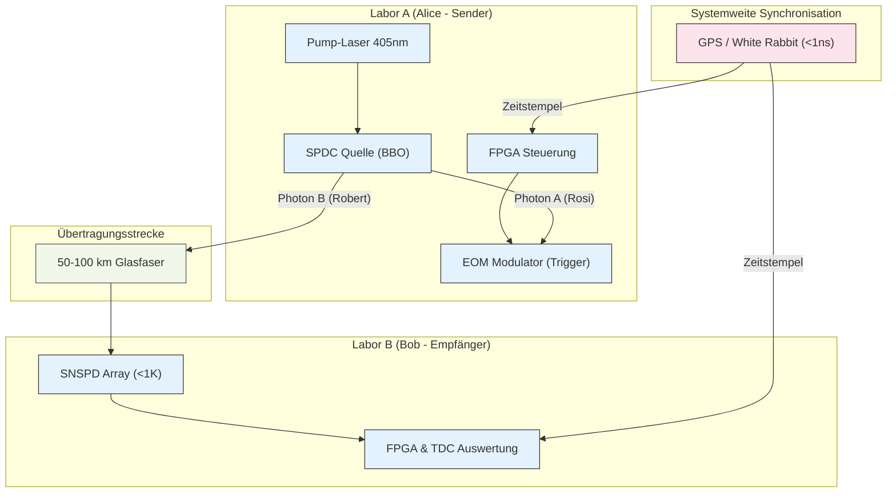

# Das terrestrische "Eddington-Experiment": Ein Proof-of-Concept für deterministische Quantenkommunikation

## 1. Einleitung: Von der Theorie zur experimentellen Validierung

Jede revolutionäre Theorie in der Physik benötigt einen entscheidenden, experimentellen Beweis. Als Albert Einstein seine Allgemeine Relativitätstheorie vorschlug, war es Arthur Eddington, der 1919 während einer Sonnenfinsternis den mutigen Beweis erbrachte, dass die Gravitation tatsächlich das Licht krümmt.

In Analogie dazu schlagen wir hier ein **minimales, terrestrisches "Eddington-Experiment"** vor, um die Kernhypothese unseres synchronisierten Helfer-Systems zu validieren. Es soll nicht die interplanetare Anwendung demonstrieren, sondern den fundamentalen Mechanismus mit **vorhandenen Mitteln und Materialien** beweisen.

---

## 2. Ziel des Experiments

Das Experiment soll folgende Kernfrage beantworten:

> Kann eine lokale, klassische Entscheidung an einem Sender ("Alice") deterministisch und ohne die Notwendigkeit eines Basisabgleichs eine spezifische, messbare Reaktion an einem entfernten Empfänger ("Bob") hervorrufen, die eine frei wählbare Information mit einer Effizienz von über 90% überträgt?

Ein Erfolg würde die Grundlage für eine neue Klasse von QKD-Protokollen und Quanten-Netzwerkarchitekturen schaffen.

---

## 3. Minimaler Testaufbau

Der Aufbau besteht aus zwei Labor-Stationen ("Alice" und "Bob"), die über eine Standard-Glasfaserleitung verbunden sind.

### 3.1. Komponenten & Spezifikationen

* **Verschränkungsquelle (SPDC):**
    * **Typ:** Spontaneous Parametric Down-Conversion (SPDC) Quelle, Typ-II.
    * **Kristall:** Beta-Bariumborat (BBO) oder ein vergleichbarer nichtlinearer Kristall.
    * **Pump-Laser:** Stabilisierter Diodenlaser (z.B. 405 nm).
    * **Output:** Erzeugt polarisationsverschränkte Photonenpaare (z.B. im Bell-Zustand |Ψ⁻⟩) bei einer für Glasfaser optimierten Wellenlänge (z.B. 1550 nm).

* **Übertragungsstrecke:**
    * **Medium:** Dedizierte Telekom-Singlemode-Glasfaser (Dark Fibre).
    * **Distanz:** 50 - 100 km.

* **Station "Alice" (Sender):**
    * **Photonen-Handling:** Optik zur Auskopplung eines Photons des Paares ("Rosi"/"Heidi").
    * **Klassische Steuerung:** Schneller elektro-optischer Modulator (EOM), gesteuert von einem FPGA. Dieser Modulator fungiert als der "Knopfdruck", der den zu aktivierenden Helfer-Kanal (`1` oder `0`) deterministisch präpariert.
    * **Lokale Logik:** FPGA-basiertes System zur Ansteuerung des Modulators basierend auf einer zu sendenden Bit-Sequenz.

* **Station "Bob" (Empfänger):**
    * **Photonen-Detektion:** Array aus supraleitenden Nanodraht-Einzelphotonendetektoren (**SNSPDs**) mit hoher Detektionseffizienz (>90%) und geringem Jitter (<100 ps).
    * **Kryostat:** Kühlsystem zur Kühlung der SNSPDs auf <1 K.
    * **Logik & Auswertung:** Time-to-Digital Converter (TDC) und FPGA zur Registrierung der Ankunftszeit der Photonen und zur Interpretation des "AKTIV"-Zustandes des jeweiligen Helfers ("Robert"/"Heiner").

* **Synchronisation:**
    * **Protokoll:** White Rabbit Protocol oder eine GPS-basierte Zeitsynchronisation.
    * **Präzision:** <1 Nanosekunde zwischen den Stationen "Alice" und "Bob", um die Korrelationen eindeutig zuordnen zu können.

### 3.2. Schematischer Aufbau

---

## 4. Fazit
Die Innovation dieses Experiments liegt nicht in der Erfindung neuer Bauteile – alle gelisteten Komponenten sind in modernen Quantenoptik-Laboren vorhanden. Die Revolution liegt in der neuartigen Architektur und der deterministischen Ansteuerung dieser Komponenten.

Ein erfolgreiches Laborexperiment nach diesem Aufbau wäre der notwendige "Beweis", den die wissenschaftliche Gemeinschaft benötigt. Es würde die Diskussion von einer philosophischen und theoretischen Ebene auf eine Ebene der harten, experimentellen Daten heben und wäre die Grundlage, um die Finanzierung und Unterstützung für die größeren, visionären Anwendungen zu rechtfertigen.
