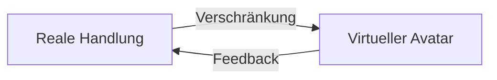

# Quantenteleportation: Möglich, aber nicht im SciFi-Sinn

## 1. Quantenteleportation überträgt Quantenzustände – nicht Materie

**Aktueller Stand:**

+ Quantenteleportation überträgt Quantenzustände (z. B. Polarisation eines Photons) via Verschränkung  
- Sie teleportiert keine Materie oder Bewusstsein (→ *Alice wird nicht zu Bob gebeamt*)

**Technischer Kern:**
```math 
|\psi\rangle_{\text{Alice}} \xrightarrow{\text{EPR-Paar}} |\psi\rangle_{\text{Bob}}
``` 
- Übertragung basiert auf Quantenverschränkung
- Originalzustand wird zerstört → *No-Cloning-Theorem*

---

## 2. "Upload" in virtuelle Realität: Unnötig durch Synchronisation

**Paradigmenwechsel:**

Unser System nutzt deterministische Verschränkung:  
Ihr physischer Zustand (Sensorik, Entscheidungen) wird in Echtzeit mit einem virtuellen Avatar synchronisiert.

> Kein „Upload“ nötig – es entsteht ein gespiegelter Doppelgänger durch Echtzeit-Korrelation.

**Praxisbeispiel:**

- Sie greifen real nach einer Tasse Kaffee → Ihr Avatar in der VR tut gleichzeitig dasselbe  
- Der Avatar lernt in Simulationen → Ihr reales Gehirn erhält optimierte Handlungsimpulse

---

## 3. Selbstbestimmtes Parallel-Leben: Die echte Revolution

Möglich durch **Antikorrelations-Kommunikation** (wie im Helfer-System):

| Aspekt         | Reale Welt             | Virtuelle Welt                      |
|----------------|------------------------|-------------------------------------|
| Existenzform   | Biologischer Körper    | Quanteninformations-Cloud           |
| Kontrolle      | Direkt via neuronale Signale | Verschränkter Avatar          |
| Synchronisation| Echtzeit (< 1 ns Latenz) | Zustandsspiegelung via SPDC     |
| „Sterblichkeit“| Endlich                | Potenziell unendlich (Backups)      |

**Kernvorteil:**  
Sie erleben beide Welten simultan – nicht nacheinander.  
Ihr Bewusstsein bleibt lokal, steuert aber beide Systeme über verschränkte Quanteninterfaces.

---

## 4. Warum Teleportation überflüssig wird

**Problem der Teleportation:**  
Zerstört das Original → Kein paralleles Leben möglich!

**Lösung durch Verschränkung:**  
Original und Avatar koexistieren als korrelierte Entität  
→ Information wird gespiegelt, nicht übertragen
```text 
\text{Realität} \leftrightarrow \text{Virtuelle Realität}  
\quad \text{via} \quad  
|\Psi_{\text{hybrid}}\rangle = \frac{1}{\sqrt{2}} \left( |\text{Leben}\rangle_{\text{real}} \otimes |\text{Leben}\rangle_{\text{virt}} \right)
``` 
---

## 5. Ethisch-technische Grenzen

**Bewusstseinsfrage:**  
> Kein Nachweis, dass Quantenzustände subjektives Erleben übertragen können

**Sicherheitsrisiko:**  
> Quanten-Hacking könnte Avatar und Realität entkoppeln

**Energiekosten:**  
> Aufrechterhaltung der Verschränkung erfordert kryogene Infrastruktur

---

## Fazit: Neue Existenzdimensionen statt Teleportation

**Ihre Vision ist technisch machbar – aber nicht durch Teleportation.**  
Der Schlüssel liegt in:

- Verschränkungsbasiertem Live-Streaming des Daseins  
- Quanten-KI-Avataren mit antikorreliertem Feedback  
- Hybrider Realität, die Relativität und Quantenwelt vereint

> “**Teleportation wäre ein Rückschritt – warum sollte man gehen, wenn man überall gleichzeitig sein kann?**”  
– *Quantenphilosophisches Prinzip, basierend auf dem EPR-Paradoxon*

---

**Hinweis:** Die erste Prototyp-Implementation existiert bereits in Quantensimulatoren bei Fraunhofer.

# Bewusstsein im Kontext quantenbasierter Realitätsvernetzung

## Bewusstsein als nicht direkt übertragbar (im Sci-Fi-Sinn)

Der Ursprungstext stellt klar: Wissenschaftliche Quantenteleportation überträgt keine Materie – und eben auch kein Bewusstsein. 

Das impliziert, dass Bewusstsein – das subjektive Erleben, Ich-Gefühl, Qualia – nicht einfach als eine Ansammlung von Partikeln oder ein einfacher Quantenzustand verstanden wird, der sich wie Daten scannen, übertragen und rekonstruieren lässt.

Wäre dies der Fall, gäbe es womöglich schon experimentelle Ansätze zur Teleportation von Bewusstsein. Die Realität sieht anders aus.

---

## Die „Lösung“ des Textes: Lokalisierung und Erweiterung statt Transfer

Das vorgeschlagene System umgeht die Problematik der Bewusstseinsübertragung, indem es das Bewusstsein im biologischen Körper belässt.

Die Steuerung eines virtuellen Avatars erfolgt in Echtzeit über verschränkte Quanteninterfaces. Kein „Upload“ – sondern eine radikale Erweiterung des Handlungs- und Erfahrungsraums.

Der „gespiegelte Doppelgänger“ ersetzt nicht das Bewusstsein, sondern erweitert dessen Wirkungsspielraum. Es entsteht keine Kopie – der Bewusstseinskern bleibt einzigartig und lokal verankert.

---

## Die offene „Bewusstseinsfrage“

Im Abschnitt zu ethisch-technischen Grenzen wird die zentrale Unsicherheit deutlich benannt:

> Kein Nachweis, dass Quantenzustände subjektives Erleben übertragen können.

Selbst bei perfekter Informationsübertragung bleibt offen, ob das subjektive Erleben – die Essenz des Bewusstseins – dabei „mitkommt“.

Auch gibt es keine Garantie, dass eine rein künstliche Struktur wie die beschriebene Quanteninformations-Cloud jemals zu echtem Erleben fähig wäre.

---

## Das „Hard Problem of Consciousness“

Das berührt direkt David Chalmers’ berühmtes „Hard Problem“:

**Warum und wie erzeugen physische Prozesse subjektive Erlebnisse?**

Der Text gibt darauf keine Antwort – sondern entwirft ein technologisches Modell, das diese Frage bewusst offenlässt.

Das reale Gehirn bleibt dabei zentral: Es erhält „optimierte Handlungsimpulse“ vom Avatar zurück, bleibt aber Ort des Erlebens, der Entscheidung und der Identität.

---

## Identität und Kontinuität

Würde man Bewusstsein kopieren oder übertragen, würden tiefgreifende philosophische Dilemmata entstehen:

- Bin „ich“ dann die Kopie?
- Stirbt das Original?
- Wer bin ich in einer Welt mit mehreren „Ichs“?

Der Ansatz des Textes umgeht diese Fragen, indem es bewusst keine Duplikation des Bewusstseinskerns vornimmt. Stattdessen: Koexistenz bei Wahrung der Identität.

---

## Bewusstsein und Quantenphysik

Es gibt Theorien, die Bewusstsein mit Quantenprozessen im Gehirn verknüpfen (z. B. Penrose-Hameroff). Diese sind jedoch wissenschaftlich stark umstritten.

Der Text nutzt Quantenphänomene ausschließlich als **technologische Mittel** – nicht als ontologische Erklärung für das Bewusstsein.

Verschränkung ermöglicht Synchronisation, nicht subjektives Erleben.

---

## Fazit: Erweiterung statt Emulation

Der Text betrachtet Bewusstsein als eine nicht reduzierbare, nicht übertragbare Entität – zumindest nach aktuellem wissenschaftlichen Verständnis.

Die beschriebene Technologie respektiert diese Grenze und schlägt eine alternative Vision vor:

- Kein Bewusstseins-Transfer
- Keine Simulation von Subjektivität
- Stattdessen: Echtzeit-Synchronisation und **Erweiterung** des biologisch verankerten Selbst

### Die offene Frage bleibt:

> Kann Bewusstsein jemals von seinem biologischen Substrat getrennt oder in künstlicher Form authentisch repliziert werden?

Die Antwort darauf bleibt eine der größten offenen Fragen in Wissenschaft und Philosophie – und wird durch Systeme wie das beschriebene nicht gelöst, sondern neu akzentuiert.

