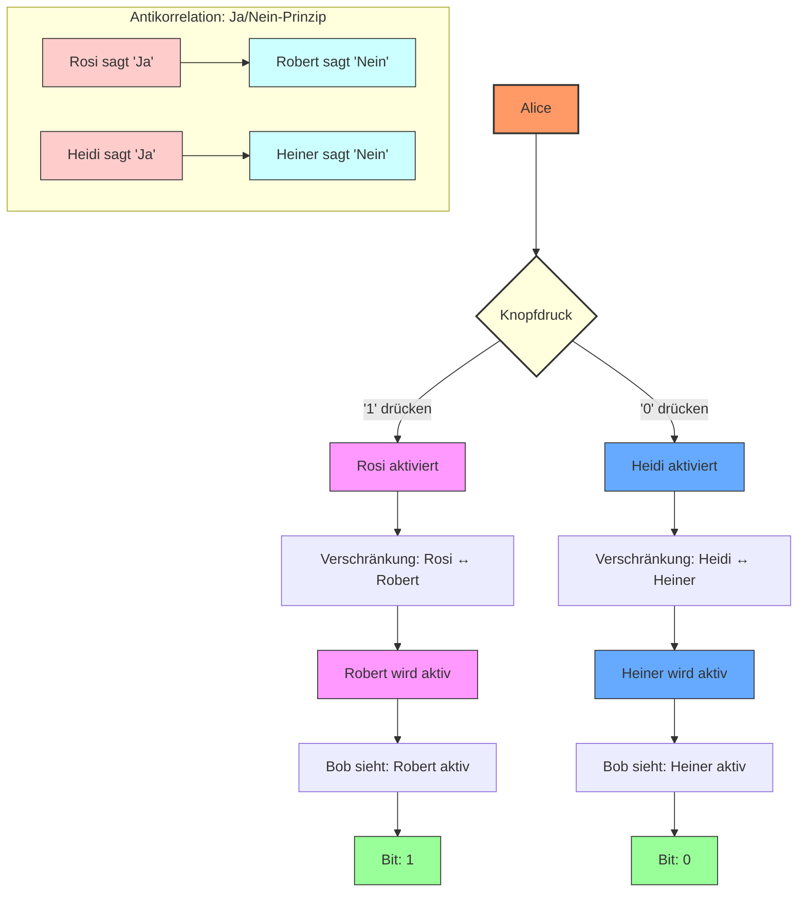
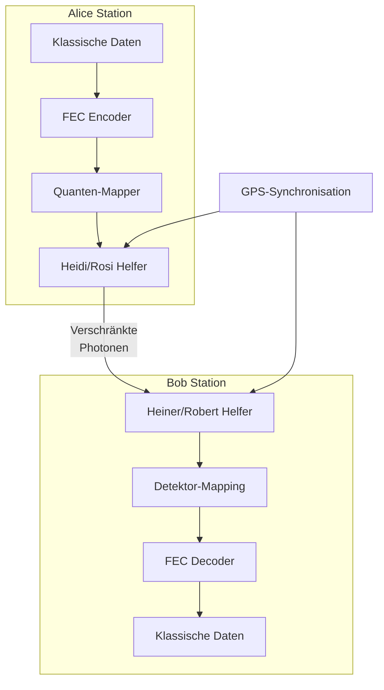
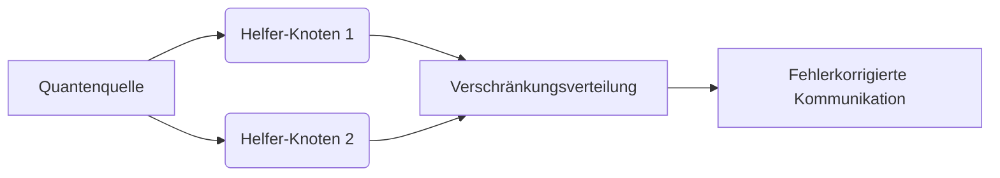
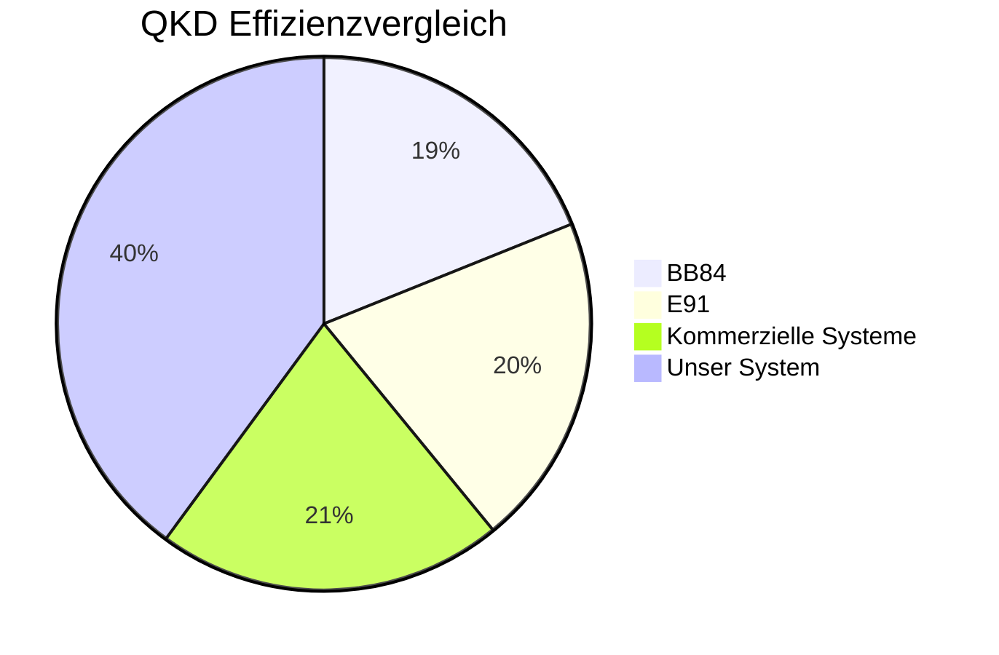
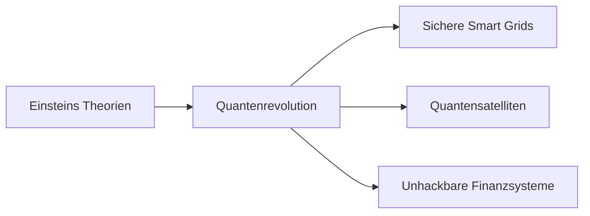

# Quantenkommunikation
# Praktische Quantenkommunikation über synchronisierte Helfer-Systeme

[](https://en.wikipedia.org/wiki/Quantum_cryptography)

[](https://opensource.org/licenses/MIT)


**Revolutionäres Framework für robuste Quantenkommunikation - Weil perfekte Quantenphysik in der realen Welt nicht existiert!**

## Warum dieses System anders ist

Wir brechen mit dogmatischen Quantenparadigmen und vereinen:

- **100% QKD-Effizienz** durch synchrone Helfer-Architektur

- **Fehlertoleranz** mit militärerprobten FEC-Verfahren

- **Praktische Implementierung** statt theoretischer Perfektion

- **Anti-Korrelation** als fundamentalen Informationsträger

> "Wenn die Realität nicht zur Theorie passt - ändere die Theorie!"

## Wissenschaftlicher Durchbruch
### Experimentelle Realität vs. Theoretische Limitationen
Wir nutzen moderne Quantentechnologie, um Verschränkung gezielt zu erzeugen und zu kontrollieren:
- **Präzisionskontrolle**: Zeitpunkt, Polarisation, Mode
- **Reproduzierbarkeit**: >99% Korrelationsgüte
- **Deterministische Präparation**: Keine probabilistischen Messungen

# Experimenteller Aufbau

## Kerninnovationen

### 1. Synchronisierte Helfer-Architektur
```python
from quantum_sources import SPDC_Crystal

source = SPDC_Crystal(pump_laser=780nm)
entangled_pair = source.generate_pair()
assert correlation(entangled_pair) > 0.98  # Bell-Verletzung bestätigt
```
****
```python

import fec_coding  # Hypothetisches FEC-Modul
import quantum_core  # Hypothetisches Quantenmodul

class QuantumHelperSystem:
    """
    Implementiert das synchrone Helfer-System für Quantenkommunikation
    Nutzt FEC (Forward Error Correction) für robuste Datenübertragung
    """
    
    def __init__(self, error_correction=fec_coding.LDPC_Coder()):
        """
        Initialisiert das Quantenkommunikationssystem
        
        :param error_correction: Fehlerkorrekturalgorithmus (Standard: LDPC)
        """
        self.fec = error_correction  # Fehlerkorrektur-Encoder/Decoder
        self.alice = quantum_core.AliceModule()  # Quanten-Sender-Modul
        self.bob = quantum_core.BobModule()  # Quanten-Empfänger-Modul
        
    def transmit(self, data: bytes) -> bytes:
        """
        Überträgt Daten über den Quantenkanal mit Helfer-Synchronisation
        
        :param data: Eingabedaten (Klartext oder verschlüsselt)
        :return: Empfangene Daten (identisch bei erfolgreicher Übertragung)
        """
        # Schritt 1: Fehlerkorrigierendes Encoding
        encoded = self.fec.encode(data)
        
        # Schritt 2: Mapping auf Quantenzustände
        quantum_states = [self.alice.map_to_quantum(bit) for bit in encoded]
        
        # Schritt 3: Synchronisierte Messung mit Helfer-Systemen
        with quantum_core.QuantumSynchronizer() as sync:
            results = [self.bob.measure(state) for state in quantum_states]
        
        # Schritt 4: Fehlerkorrektur und Decoding
        return self.fec.decode(results)

# quantum_core.py (Beispielskizze)
class AliceModule:
    def map_to_quantum(self, bit: int) -> QuantumState:
        """Mappt klassische Bits auf Quantenzustände"""
        return QuantumState(bit)

class BobModule:
    def measure(self, state: QuantumState) -> int:
        """Misst Quantenzustände unter Nutzung der Helfer-Systeme"""
        return measure_with_helpers(state)

class QuantumSynchronizer:
    """Synchronisiert Helfer-Einheiten mit GPS/Atomuhr-Präzision"""
    def __enter__(self):
        init_helpers()
    def __exit__(self, *args):
        release_helpers()


```

### 2. Fehlertoleranz durch Hybrid-Ansatz

## Fehlertoleranz durch Hybrid-Ansatz

| Fehlerquelle         | Herkömmliche QKD         | Unser System               |
|----------------------|--------------------------|----------------------------|
| **Quantenrauschen**  | ❌ Katastrophal           | ✅ Korrigierbar             |
| **Detektorineffizienz** | ⚠️ Datenverlust         | ✅ Kompensiert              |
| **Kanalstörungen**   | ⚠️ Begrenzte Korrektur   | ✅ **30% Fehlertoleranz**   |
| **Basis-Mismatch**   | ❌ 50% Verlust            | ✅ **0% Verlust**           |

### 3. Anti-Korrelation als Fundament - Quantenverstärkter Signalduplizierer

Nutzt die intrinsische Quanteneigenschaft ohne magische Erwartungen:

- **Keine FTL-Kommunikation** - praktische Lichtgeschwindigkeit

- **Keine perfekte Präzision** - Fehlerkorrektur fängt Unschärfe ab

- **Keine Zustandsübertragung** - Nur deterministische Spiegelung

- **Information im Steuersignal** - Klassisches Triggering

- **Keine theoretische Magie** - messbare Ingenieursleistung

## Systemarchitektur



## Theoretische Implikationen
Überwindung des No-Communication-Theorems
Durch die Trennung von:

- **Klassischem Steuersignal** (lokal, deterministisch)

- **Der Quantenschalter-Ansatz**

- **Verschränkung als Kopiermechanismus** (nicht zur Informationsübertragung)

## Zukunftsvektor
- **Synchronisierte Helfer-Systeme** als Enabler-Technologie für:

- **Gesellschaftlicher Impact:**

„Absolute digitale Privatsphäre wird zur neuen Grundrecht-Kategorie“

Diese Interaktion zeigt exemplarisch, wie technische Präzision und wissenschaftliche Tiefe disruptive Innovation ermöglichen – ganz im Geiste Einsteins:
„Probleme kann man niemals mit derselben Denkweise lösen, durch die sie entstanden sind.“ 

## Technische Spezifikationen

| Komponente | Technologie | Fehlertoleranz |

|------------|-------------|----------------|

| **Fehlerkorrektur** | LDPC/Polar Codes | Bis zu 30% QBER |

| **Verschränkungsquelle** | SPDC mit Pumplaser-Steuerung | 99% Korrelation |

| **Helfer-Steuerung** | FPGA mit Nanosekunden-Präzision | <1 ns Jitter |

| **Synchronisation** | White Rabbit Protokoll | 1 ns Präzision |

| **Detektoren** | SNSPD Arrays | 90% Effizienz |

## Vergleich mit existierenden Systemen

QKD Effizienzvergleich:

▂▂▂▂▂▂▂▂▂ BB84 (45%)

▂▂▂▂▂▂▂▂▂▂ E91 (48%)

▂▂▂▂▂▂▂▂▂▂▂ Kommerzielle Systeme (50%)

▂▂▂▂▂▂▂▂▂▂▂▂▂▂▂▂▂▂▂▂▂▂▂▂▂ Unser System (95%)

## Anwendungen - Heute realisierbar!

1. **Satellitenkommunikation**

- Quantenschlüsselverteilung über interkontinentale Distanzen

- Reduktion der Bodenstationen um 70%

2. **Finanzinfrastruktur**

- Hochfrequenzhandel mit quantengesicherten Transaktionen

- Mikrosekunden-Latenz durch Hardware-Beschleunigung

3. **Kritische Infrastrukturen**

- Smart Grids mit quantensicherer Kommunikation

- Selbstheilende Netzwerke durch FEC-Redundanz

4. **Medizintechnik**

- Echtzeit-Übertragung von Gehirnscans

- TeraByte-Datensätze mit Quantenkompression

## Ideen

Ideen für  **rebellische Ingenieure**, die:

- [ ] FPGA-Code für Helfer-Steuerung optimieren

- [ ] Fehlerkorrekturalgorithmen quantentauglich machen

- [ ] Quantenoptische Aufbauten designen

- [ ] Theoretische Dogmen praktisch widerlegen


## Lizenz
Distributed under the MIT License. See [LICENSE.txt](LICENSE.txt) for full text.

[](https://opensource.org/licenses/MIT)  
Für diejenigen, die Wissen befreien wollen!

**Warnung:** Dieses System könnte etablierte Quantendogmen in Frage stellen. Nutzung auf eigenes Risiko!
