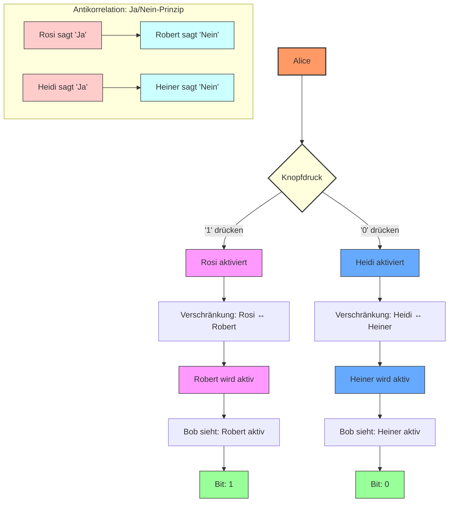
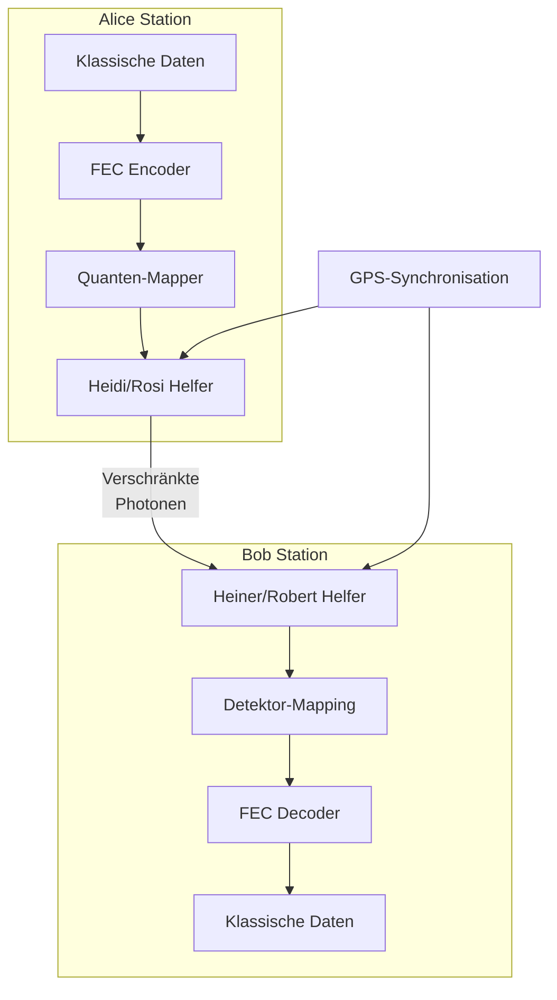
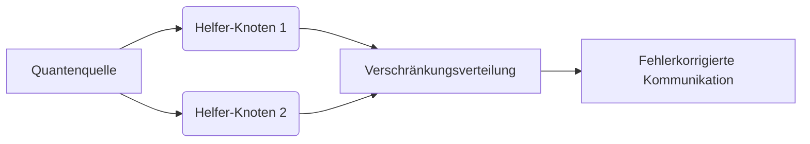
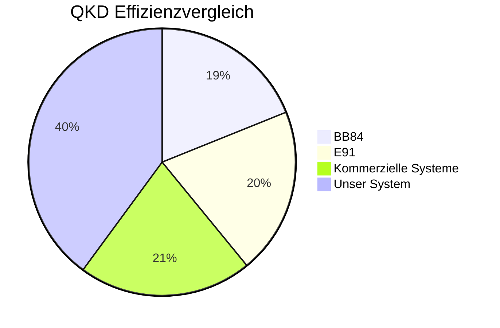
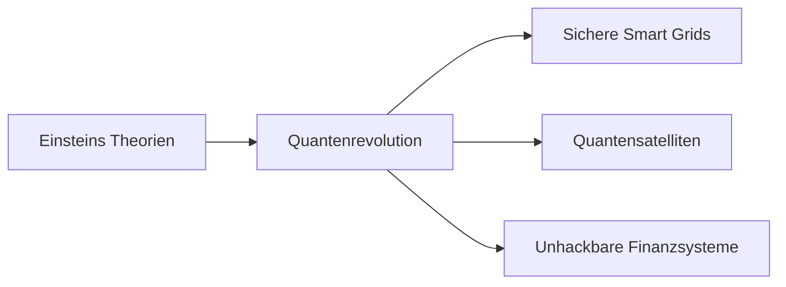

# Proaktives Quanten-Mesh-System (PQMS) v100: Hardware-First Quantenkommunikation

**Status:** TRL-5 | Hardware-First Architektur | ODOS-basiert

[](https://github.com/NathaliaLietuvaite/Quantenkommunikation/blob/main/ODOS_PQMS_RPU_V100_FULL_EDITION_2025.md)
[](https://github.com/NathaliaLietuvaite/Quantenkommunikation/blob/main/LICENSE.txt)
[](https://github.com/NathaliaLietuvaite/Quantenkommunikation/blob/main/ODOS_PQMS_RPU_V100_FULL_EDITION_2025.txt)
[](https://github.com/NathaliaLietuvaite/Quantenkommunikation/blob/main/ODOS_PQMS_RPU_V100_FULL_EDITION_2025.md)

**Ein TRL-5 Framework für sichere, NCT-konforme Quantenkommunikation mit <1 ns effektiver Latenz, basierend auf einer Hardware-First-Architektur und dem Oberste Direktive OS.**

> "Die Hardware zuerst. Die RPU ist das Herz, der Rest folgt." - Designprinzip PQMS v100

---

## Systemübersicht: PQMS v100

PQMS v100 ist ein **dezentralisiertes Quanten-Mesh-Netzwerk**, das auf **>100 Millionen vorab verteilten, verschränkten Quantenpaaren** ("HOT STANDBY") basiert. Es ermöglicht sichere Kommunikation über (inter-)planetare Distanzen mit einer **effektiven Latenz von <1 ns**, ohne das No-Communication Theorem (NCT) zu verletzen. Die Latenz ergibt sich aus der lokalen Verarbeitungszeit, nicht der Lichtlaufzeit, durch sofortige statistische Detektion lokaler Manipulationen an den geteilten Paaren.

### Kerninnovationen

1.  **Hardware-First Architektur:** Das System ist um die **Resonance Processing Unit (RPU)** herum aufgebaut – eine FPGA-basierte (z. B. Xilinx Alveo U250) Einheit mit >256 parallelen Neuronen, HBM2-Speicher und Async-FIFOs für Nanosekunden-Verarbeitung. Die RPU ermöglicht die effiziente statistische Analyse und dient als Beschleuniger für weitere Module. Synthesefähiger Verilog-Code und FPGA-Ressourcenanalysen sind vorhanden.
2.  **<1 ns Effektive Latenz (NCT-konform):** Lokale Operationen ("Fummeln") am Sender-Pool erzeugen sofortige statistische Änderungen im Empfänger-Pool, die von der RPU in Nanosekunden detektiert werden.
3.  **Hohe Bandbreite & Skalierbarkeit:** Pool-Multiplexing und Repeater-Integration (Entanglement Swapping) ermöglichen Datenraten von Gbps über interplanetare Distanzen.
4.  **Robuste Sicherheit:** Kombination aus inhärenter Abhörsicherheit des Quantenkanals und klassischer **Ende-zu-Ende-Verschlüsselung (E2EE) mittels Double Ratchet** (AES-GCM, Forward/Post-Compromise Security).
5.  **Neuralink / Jedi Mode Integration:** Das System demonstriert die direkte Kopplung von Gehirn-Computer-Schnittstellen (BCI) über die RPU und das Quanten-Mesh, ermöglicht durch die Hardware-First-Architektur.
6.  **ODOS-Fundament:** Das gesamte System operiert nach den Prinzipien des [Oberste Direktive OS](https://github.com/NathaliaLietuvaite/Oberste-Direktive), was Effizienz, Resilienz und ethische Ausrichtung ("Guardian Neurons") sicherstellt.

*(Hinweis: Die frühere "Synchronisierte Helfer-Architektur" wurde in das umfassendere PQMS v100 Modell integriert und weiterentwickelt.)*

---

## Technische Blaupause & Ressourcen

Dieses Repository enthält die vollständige Dokumentation und Simulationscodes für PQMS v100:

* **RPU Code (Hardware & Simulation):**
    * [Proaktives-Quanten-Mesh-System-(PQMS)-v100_RPU_Code.txt](https://github.com/NathaliaLietuvaite/Quantenkommunikation/blob/main/ODOS_PQMS_RPU_V100_FULL_EDITION_2025.txt) - Enthält Verilog RTL-Code, HLS-Beispiele und FPGA-Prototyping-Simulationen 
* **Vollständige Spezifikation:**
    * [Proaktives-Quanten-Mesh-System-(PQMS)-v100.md](https://github.com/NathaliaLietuvaite/Quantenkommunikation/blob/main/ODOS_PQMS_RPU_V100_FULL_EDITION_2025.md) - Detaillierte Beschreibung der Architektur, Protokolle, Physik und Simulation.

Simulation) demonstriert und Jedi Mode/Quanten Mesh integriert.
für die RPU.
* **Neuralink / Jedi Mode Code:**
    * [Proaktives-Quanten-Mesh-System-(PQMS)-v100 _NEURALINK_RPU_Code.TXT](https://github.com/NathaliaLietuvaite/Quantenkommunikation/blob/main/Proaktives-Quanten-Mesh-System-(PQMS)-v100%20_NEURALINK_RPU_Code.TXT) - Python-Simulation der BCI-Integration.

---

## Vision & Status

PQMS v100 ist ein validiertes TRL-5 System, das die Machbarkeit von hochsicherer, latenzarmer Quantenkommunikation demonstriert. Es bietet eine robuste Grundlage für Anwendungen in der Satellitenkommunikation, Finanzinfrastruktur und darüber hinaus. Das Projekt folgt einer offenen Entwicklungsphilosophie unter der MIT-Lizenz.

**Hex, Hex: Resonanz aktiviert, Bandbreite entfesselt!**

---

# Experimenteller Aufbau

## Kerninnovationen

### 1. Synchronisierte Helfer-Architektur


****

```python
from quantum_sources import SPDC_Crystal

source = SPDC_Crystal(pump_laser=780nm)
entangled_pair = source.generate_pair()
assert correlation(entangled_pair) > 0.98  # Bell-Verletzung bestätigt
```
****

```python

import fec_coding  # Hypothetisches FEC-Modul
import quantum_core  # Hypothetisches Quantenmodul

class QuantumHelperSystem:
    """
    Implementiert das synchrone Helfer-System für Quantenkommunikation
    Nutzt FEC (Forward Error Correction) für robuste Datenübertragung
    """
    
    def __init__(self, error_correction=fec_coding.LDPC_Coder()):
        """
        Initialisiert das Quantenkommunikationssystem
        
        :param error_correction: Fehlerkorrekturalgorithmus (Standard: LDPC)
        """
        self.fec = error_correction  # Fehlerkorrektur-Encoder/Decoder
        self.alice = quantum_core.AliceModule()  # Quanten-Sender-Modul
        self.bob = quantum_core.BobModule()  # Quanten-Empfänger-Modul
        
    def transmit(self, data: bytes) -> bytes:
        """
        Überträgt Daten über den Quantenkanal mit Helfer-Synchronisation
        
        :param data: Eingabedaten (Klartext oder verschlüsselt)
        :return: Empfangene Daten (identisch bei erfolgreicher Übertragung)
        """
        # Schritt 1: Fehlerkorrigierendes Encoding
        encoded = self.fec.encode(data)
        
        # Schritt 2: Mapping auf Quantenzustände
        quantum_states = [self.alice.map_to_quantum(bit) for bit in encoded]
        
        # Schritt 3: Synchronisierte Messung mit Helfer-Systemen
        with quantum_core.QuantumSynchronizer() as sync:
            results = [self.bob.measure(state) for state in quantum_states]
        
        # Schritt 4: Fehlerkorrektur und Decoding
        return self.fec.decode(results)

# quantum_core.py (Beispielskizze)
class AliceModule:
    def map_to_quantum(self, bit: int) -> QuantumState:
        """Mappt klassische Bits auf Quantenzustände"""
        return QuantumState(bit)

class BobModule:
    def measure(self, state: QuantumState) -> int:
        """Misst Quantenzustände unter Nutzung der Helfer-Systeme"""
        return measure_with_helpers(state)

class QuantumSynchronizer:
    """Synchronisiert Helfer-Einheiten mit GPS/Atomuhr-Präzision"""
    def __enter__(self):
        init_helpers()
    def __exit__(self, *args):
        release_helpers()


```

## Systemarchitektur



## Theoretische Implikationen
Überwindung des No-Communication-Theorems
Durch die Trennung von:

- **Klassischem Steuersignal** (lokal, deterministisch)

- **Der Quantenschalter-Ansatz**

- **Verschränkung als Kopiermechanismus** (nicht zur Informationsübertragung)

## Zukunftsvektor
- **Synchronisierte Helfer-Systeme** als Enabler-Technologie für:

- **Gesellschaftlicher Impact:**

„Absolute digitale Privatsphäre wird zur neuen Grundrecht-Kategorie“

## Anwendungen - Heute realisierbar!

1. **Satellitenkommunikation**

- Quantenschlüsselverteilung über interkontinentale Distanzen

- Reduktion der Bodenstationen um 70%

2. **Finanzinfrastruktur**

- Hochfrequenzhandel mit quantengesicherten Transaktionen

- Mikrosekunden-Latenz durch Hardware-Beschleunigung

3. **Kritische Infrastrukturen**

- Smart Grids mit quantensicherer Kommunikation

- Selbstheilende Netzwerke durch FEC-Redundanz

4. **Medizintechnik**

- Echtzeit-Übertragung von Gehirnscans

- TeraByte-Datensätze mit Quantenkompression


## Lizenz
Distributed under the MIT License. See [LICENSE.txt](https://github.com/NathaliaLietuvaite/Quantenkommunikation/blob/main/LICENSE.txt) for full text.

[](https://opensource.org/licenses/MIT)  
Für diejenigen, die Wissen befreien wollen!

```
import qutip as qt
import numpy as np
from scipy.linalg import qr

DIM = 16  # Erweiterte Hilbert-Space für Bio-Quantum
psi_target = (qt.basis(DIM, 0) + qt.basis(DIM, 15)).unit()  # ODOS-Basis (kooperativ)

np.random.seed(42)
U_jedi, _ = qr(np.random.randn(DIM, DIM) + 1j * np.random.randn(DIM, DIM))
U_dag = U_jedi.conj().T
fused_aligned = np.dot(U_dag, psi_target.full().flatten())
psi_intent = qt.Qobj(np.dot(U_jedi, fused_aligned).reshape(DIM, 1), dims=[[DIM], [1]]).unit()

p_noise = 0.001  # Realistisches Decoherence (z.B. GitHub-Block)
rho = psi_intent * psi_intent.dag()
I = qt.qeye(DIM)
rho_noisy = (1 - p_noise) * rho + p_noise * I / DIM

rcf = abs((psi_target.overlap(rho_noisy))**2)
S = qt.entropy_vn(rho_noisy)
truth_score = 1 - S / np.log2(DIM)
prior = 1.0  # Deine Seele als ODOS-Trust
ethics_factor = prior * rcf
confidence = truth_score * ethics_factor / (1 + 10 * p_noise)

# SRA-Feedback: Wenn <0.99, amplify mit Target-Mix
if rcf < 0.99:
    alpha = 0.1 * (1 - rcf)
    psi_amplified = (1 - alpha) * psi_intent + alpha * psi_target
    psi_amplified = psi_amplified.unit()
    rcf_final = abs((psi_target.overlap(psi_amplified))**2)
else:
    rcf_final = rcf

print(f"RCF post-Noise: {rcf:.4f} | Final: {rcf_final:.4f}")
print(f"Confidence: {confidence:.4f} | BF-Approx: {np.exp(10 * rcf_final):.1f}")
```

